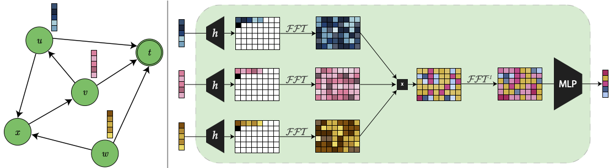
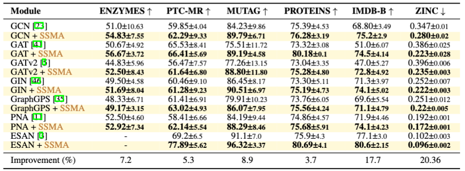
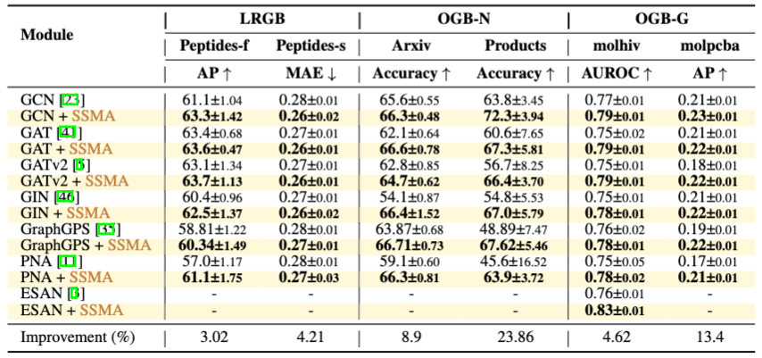

# Deep Set Aggregation for Message Passing Graph Neural Networks

## Overview

This repository contains the official implementation of the paper *Sequential Signal Mixing Aggregation for Message Passing Graph Neural Networks*. Using this repository, you can reproduce all the results presented in the paper.

### Repository Structure
- **`data/datasets.py`** - Contains all the datasets used in the paper, including a script to get the dataset statistics.
- **`models/pyg.net.py`** - Contains all the models used in the paper.
- **`configs`** - Contains the configurations used for running the experiments in the paper.
- **`scripts`** - Contains helper scripts used to run the experiments.
  - **`scripts/paper_hps`** - Contains the hyperparameter configurations for the paper.
- **`ssma.py`** - Contains the implementation of the SSMA aggregator.
- **`train.py`** - The entry point for the training performed.
- **`pna_zinc`** - Contains the code used to run the PNA model on the ZINC dataset, including the implementation from the original PNA repository.

## Installation

We used an Anaconda environment for this project. You can reproduce the environment using the `environment.yaml` file in this repository.

**Note:** Our training and logging heavily depend on the Weights and Biases (wandb) API. We performed our hyperparameter search (HPS) using the wandb infrastructure incorporated with Hydra. Although the code can run without it, it's highly recommended to activate it.

## Reproduce the Paper Results

### Datasets Statistics

To reproduce the dataset statistics used in the paper, run the script:
```bash
python data/get_dataset_statistics.py
```

### Baseline Models

To reproduce the baseline model results, run the script:
```bash
scripts/run_sweep.py NONE scripts/run_paper_exp_sweep.yaml 0 1 2 3
```
Read the script for more details. This script will launch a Weights and Biases sweep to run all the relevant experiments.

### SSMA Models

All the SSMA aggregation models are listed in the `scripts/generate_paper_runs.sh` script. Use this script to run the desired configuration.

### PNA - ZINC

To reproduce the results of the PNA model on the ZINC dataset, use the `pna_zinc` folder. Run the script:
```bash
python pna_zinc/main.py
```
To follow the HPS we conducted, refer to the configuration in `pna_zinc/zinc_pna_hps.yaml`.

### VPA
We used the VPA HPS configuration and injected our SSMA aggregator into their architecture, by replacing the 'add' aggregation with our SSMA aggregation.
We refer the user to VPA repository for more details, we used the main branch of the repository where head was in commit id: `e29acac`.

### ESAN
We used the ESAN repository directly and injected our SSMA aggregator into their architecture, by replacing the 'add' aggregation with our SSMA aggregation.
We used the DSS-GNN (GIN) (EGO+) model from the ESAN repository for all the datasets. We used the main branch of the repository where head was in commit id: `a4199fe`.

### Ablations
The configurations for the ablation experiments located in:
* Attention ablation: `scripts/attention_ablation.yaml`
* Circular convolution ablation: `scripts/circular_conv_ablation.yaml`
* Affine learning ablation: `scripts/affine_learning_ablation.yaml`
* Compression MLP ablation: `scripts/compression_ablation.yaml`

## Results



## Contributing
Feel free to open an issue or submit a pull request if you have any suggestions or improvements.  
This project is licensed under the MIT License.
